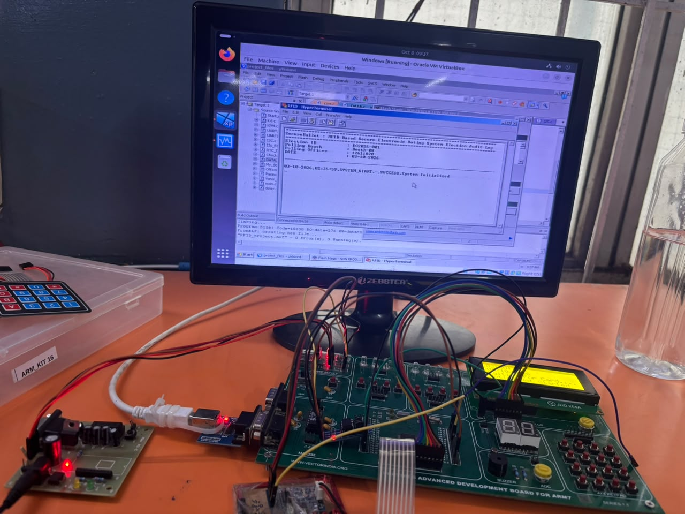
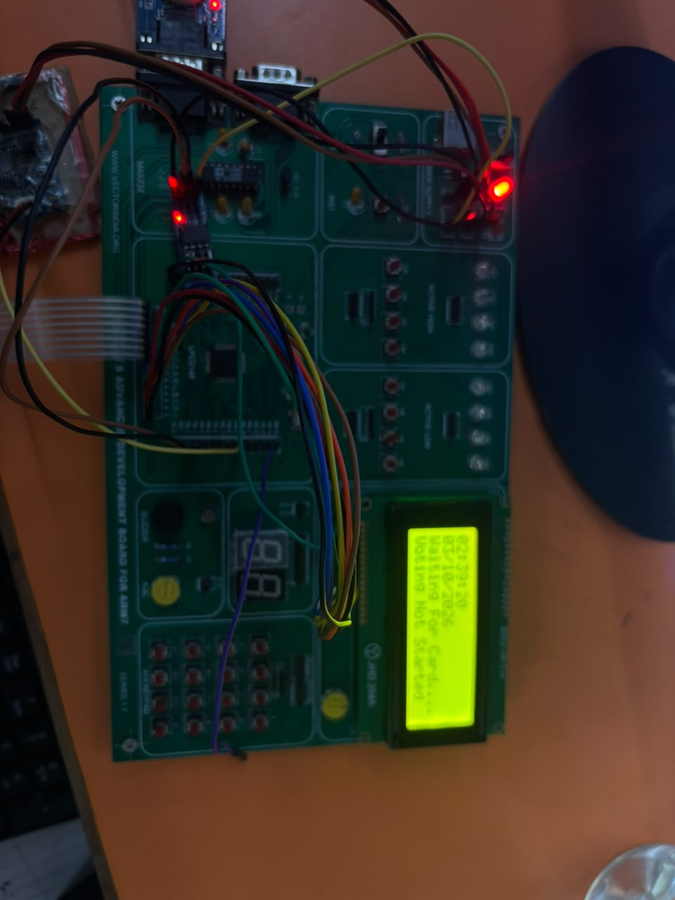
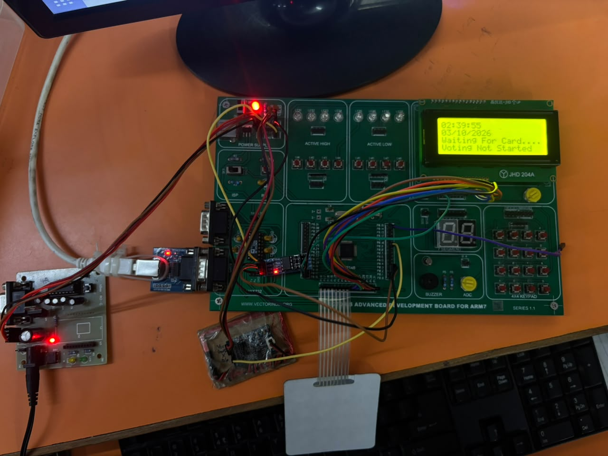
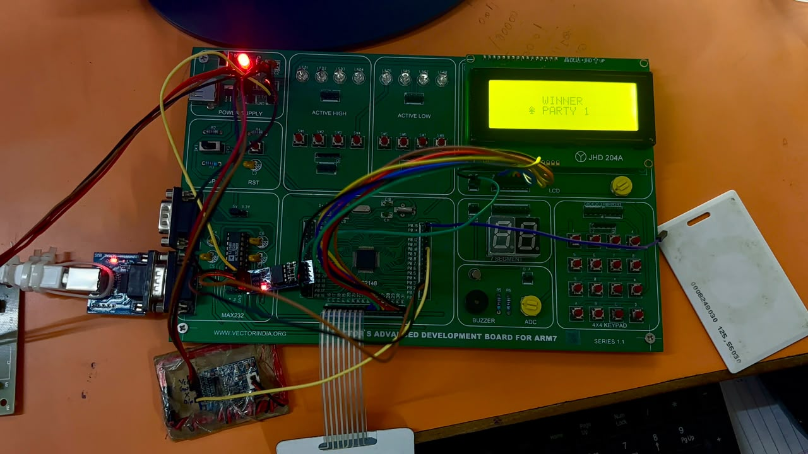

# 🔐 Secure Ballot – RFID-Based Electronic Voting System

## 📌 Project Overview

The **Secure Ballot – RFID-Based Electronic Voting System** is an embedded system developed using the **LPC2148 ARM7 microcontroller** to provide a secure and controlled electronic voting process.

The system integrates an **EM-18 RFID reader, 20×4 LCD, 4×4 keypad, RTC, I2C EEPROM, UART, and password-based authentication**.

The system allows an administrator to configure the election, authenticate voters using RFID, prevent duplicate voting, manage the voting period, count votes, and display election results.

---

# 🎯 Objectives

- Provide secure voter authentication using RFID.
- Authenticate the administrator using RFID and password protection.
- Validate registered voters.
- Prevent unauthorized voting.
- Prevent duplicate voting.
- Configure election start and end time.
- Store voter status using EEPROM.
- Provide a user-friendly LCD and keypad interface.
- Maintain vote counts.
- Display election results.
- Provide UART-based serial monitoring.

---

# ⚙️ Hardware Requirements

- LPC2148 ARM7 Microcontroller
- EM-18 RFID Reader
- 20×4 LCD
- 4×4 Matrix Keypad
- RTC
- I2C EEPROM
- UART Interface
- LEDs
- Power Supply
- Connecting Wires / Hardware Setup

---

# 💻 Software Requirements

- Embedded C
- LPC2148 ARM7
- Keil µVision
- ARM7 Compiler
- GPIO Programming
- UART Programming
- I2C Programming
- RTC Programming
- LCD Interfacing
- Keypad Interfacing
- RFID Interfacing
- EEPROM Interfacing
- Embedded Debugging
- Serial Terminal

---

# 🧩 System Architecture

The LPC2148 acts as the main controller and interfaces with the RFID reader, LCD, keypad, RTC, EEPROM, and UART monitoring interface.

```text
                    ┌──────────────────┐
                    │   EM-18 RFID     │
                    │     Reader       │
                    └────────┬─────────┘
                             │
                           UART1
                             │
                             ▼
                    ┌──────────────────┐
                    │     LPC2148      │
                    │      ARM7        │
                    │  Microcontroller │
                    └───────┬──┬──┬────┘
                            │  │  │
              ┌─────────────┘  │  └─────────────┐
              │                 │                │
              ▼                 ▼                ▼
        ┌───────────┐     ┌───────────┐    ┌───────────┐
        │    LCD    │     │  Keypad   │    │    RTC    │
        │   20×4    │     │    4×4    │    │           │
        └───────────┘     └───────────┘    └───────────┘
                                │
                                ▼
                         ┌──────────────┐
                         │ I2C EEPROM   │
                         │ Voter Status │
                         └──────────────┘
                                │
                                ▼
                         ┌──────────────┐
                         │ UART / PC    │
                         │  Monitoring  │
                         └──────────────┘
```

---

# 📸 Project Demonstration

## 🔧 Hardware Setup

The complete hardware setup of the Secure Ballot RFID-Based Electronic Voting System.



---

## 📟 LCD and Keypad Interface

The LCD and 4×4 keypad are used for menu navigation, password entry, voting selection, and system information.



---

## 🧾 Serial Audit Log

The UART serial interface is used to monitor RFID communication and system information during development and debugging.



---

## 🏆 Election Result

The system maintains vote counts and displays the election result after the voting process.



---

# 📁 Project Structure

```text
SECURE_BALLOT_RFID_BASED_VOTING_SYSTEM/
│
├── images/
│   ├── election_results.jpg
│   ├── hardware_setup.jpg
│   ├── lcd_keypad.jpg
│   └── serial_audit_log.jpg
│
├── Check.c
├── DATA.c
├── I2C.c
├── I2c_Eeprom.c
├── KPM.c
├── My_Str_Func.c
├── Officer_interface.c
├── Password.c
├── RTC_Defaults.c
├── UART.c
├── UART1.c
├── Voter_Interface.c
├── delay.c
├── lcd.c
├── main.c
│
├── Header Files
│
├── project_files.uvproj
├── project_files.uvopt
├── major_project.hex
└── README.md
```

---

# 📂 File and Folder Description

| File / Folder | Purpose |
|---|---|
| `images/` | Project hardware and demonstration images |
| `main.c` | Main application entry point |
| `Voter_Interface.c` | Voter-related operations |
| `Officer_interface.c` | Administrator/officer operations |
| `Password.c` | Password authentication and management |
| `KPM.c` | Keypad interfacing |
| `lcd.c` | LCD interfacing |
| `UART.c` | UART communication |
| `UART1.c` | UART1 communication for RFID interface |
| `I2C.c` | I2C communication |
| `I2c_Eeprom.c` | EEPROM read/write operations |
| `RTC_Defaults.c` | RTC-related configuration |
| `delay.c` | Delay functions |
| `My_Str_Func.c` | String utility functions |
| `project_files.uvproj` | Keil µVision project file |
| `project_files.uvopt` | Keil project options |
| `major_project.hex` | Generated HEX file |
| `README.md` | Project documentation |

---

# 🔐 Administrator Authentication

The administrator must authenticate before accessing election management functions.

```text
Administrator RFID Card
          ↓
      EM-18 Reader
          ↓
        UART1
          ↓
    RFID Validation
          ↓
   Password Verification
          ↓
      ┌────┴────┐
      │         │
    Valid     Invalid
      │         │
      ▼         ▼
 Admin Menu   Access Denied
```

The administrator can access functions such as:

- Election configuration
- Voting start time
- Voting end time
- Password modification
- Election result viewing
- Result announcement

The system also provides protection against repeated incorrect password attempts.

---

# 🗳️ Voter Authentication and Voting

The voter presents an RFID card to the EM-18 reader.

The RFID reader sends the received card information to the LPC2148 through **UART1**.

The controller validates the RFID information and checks the voter's stored status.

```text
Voter Presents RFID Card
          ↓
      EM-18 Reader
          ↓
        UART1
          ↓
    RFID Validation
          ↓
   Check Voter Status
          ↓
      ┌────┴─────┐
      │          │
   New Voter   Already Voted
      │          │
      ▼          ▼
 Allow Voting   Reject
      │
      ▼
 Party Selection
      │
      ▼
 Update Vote Count
      │
      ▼
 Update Voter Status
      │
      ▼
 Voting Completed
```

---

# 📡 RFID Communication

The **EM-18 RFID reader** is used for administrator and voter identification.

The reader communicates with the LPC2148 using **UART1**.

The RFID data frame is processed by the LPC2148 before voter or administrator validation.

### Example Frame Structure

```text
0x02 + RFID Data + 0x03
```

The controller receives the RFID data, processes the frame, and validates the RFID information.

---

# 💾 EEPROM-Based Voter Validation

An external **I2C EEPROM** is used to maintain voter-related information.

The EEPROM is used for:

- Storing voter status
- Validating registered voters
- Identifying voters who have already voted
- Preventing duplicate voting
- Maintaining voter information

After a successful vote, the voter's status is updated so that the same voter cannot cast another vote.

---

# ⏰ Election Time Management

The RTC is used to control the election period.

The administrator can configure:

- Election start time
- Election end time

The system continuously checks the RTC time.

```text
Before Election Start
          ↓
     Voting Closed
          ↓
During Election Period
          ↓
      Voting Active
          ↓
After Election End
          ↓
     Voting Closed
```

This ensures that voting is available only during the configured election period.

---

# 📟 LCD Interface

The **20×4 LCD** is used to display system information.

The LCD can display:

- Welcome messages
- Administrator authentication
- Password entry
- RFID validation status
- Voting status
- Party selection
- Error messages
- Election information
- Election results

---

# 🔢 Keypad Interface

The **4×4 matrix keypad** is used for user input and menu navigation.

The keypad is used for:

- Password entry
- Menu navigation
- Party selection
- Election configuration
- Administrator operations

---

# 🖥️ UART Serial Monitoring

UART is used for RFID communication and serial monitoring.

### Typical UART Configuration

```text
Baud Rate : 9600
Data Bits : 8
Parity    : None
Stop Bits : 1
```

Serial monitoring can be used during development to observe RFID data and system-related information.

---

# 🧩 Major Modules

### LPC2148 ARM7

Main microcontroller responsible for controlling the complete system.

### EM-18 RFID Reader

Reads RFID cards for administrator and voter authentication.

### 20×4 LCD

Displays system messages, menus, voting status, and results.

### 4×4 Matrix Keypad

Provides user input for password, menu navigation, voting selection, and configuration.

### RTC

Provides real-time information and controls the election period.

### I2C EEPROM

Stores voter status and related validation information.

### UART

Provides communication with the RFID reader and serial monitoring interface.

### Election Management Logic

Handles authentication, election timing, voter validation, voting, vote counting, and result management.

---

# 🔄 Overall Working Flow

```text
Power ON
   ↓
Initialize LPC2148 Peripherals
   ↓
Initialize LCD / Keypad / UART / RTC / EEPROM
   ↓
System Ready
   ↓
Administrator Authentication
   ↓
RFID Validation
   ↓
Password Authentication
   ↓
Election Configuration
   ↓
Wait for Voting Start Time
   ↓
Voting Period Active
   ↓
Voter RFID Authentication
   ↓
Check Voter Status
   ↓
Allow / Reject Voting
   ↓
Party Selection
   ↓
Update Vote Count
   ↓
Update Voter Status
   ↓
Continue Voting
   ↓
Election End Time
   ↓
Voting Closed
   ↓
Display Election Result
```

---

# 🛠️ Build and Execution

### 1. Open the Project

Open the project in **Keil µVision** using the LPC2148 ARM7 project configuration.

### 2. Configure the Target

Select the appropriate LPC2148 ARM7 target and configure the project.

### 3. Add Source Files

Make sure all required source and header files are included.

### 4. Compile the Project

Build the project and check for compilation errors and warnings.

### 5. Generate the HEX File

Configure the project to generate the required `.hex` file after a successful build.

### 6. Program the Microcontroller

Use a compatible LPC2148 programming tool to transfer the generated HEX file to the microcontroller.

### 7. Connect the Hardware

Connect the RFID reader, LCD, keypad, RTC, EEPROM, LEDs, UART interface, and required hardware.

### 8. Run the System

Power on the system and verify administrator authentication, election configuration, RFID validation, voting operation, duplicate-vote prevention, and result management.

---

# 🧪 Testing and Verification

| Module | Test Performed | Expected Result |
|---|---|---|
| RFID | Card reading test | RFID data received correctly |
| UART | Communication test | Correct serial data received |
| LCD | Display test | Messages displayed correctly |
| Keypad | Key press test | Correct key input detected |
| RTC | Time test | Correct election timing |
| EEPROM | Read/write test | Voter status stored correctly |
| Authentication | RFID/password test | Unauthorized access rejected |
| Voting | Voting operation test | Valid voter allowed to vote |
| Duplicate Voting | Repeated RFID test | Already-voted voter rejected |
| Results | Vote-count test | Correct result displayed |

---

# 🔬 Integrated Testing

After individual module verification, all modules can be integrated and tested as a complete system.

```text
Power ON
   ↓
Peripheral Initialization
   ↓
Administrator Authentication
   ↓
Election Configuration
   ↓
Election Start
   ↓
RFID Voter Authentication
   ↓
Voter Status Verification
   ↓
Voting
   ↓
EEPROM Status Update
   ↓
Vote Count Update
   ↓
Election End
   ↓
Election Result
```

---

# ⚠️ Challenges and Solutions

## 1. RFID Data Reception

**Challenge:**  
The RFID reader continuously transmits card information and the microcontroller must correctly identify the received RFID frame.

**Solution:**  
UART1 is used to receive and process RFID data according to the reader's communication format.

## 2. Duplicate Voting

**Challenge:**  
A voter must not be allowed to cast more than one vote.

**Solution:**  
Voter status is maintained using external EEPROM. The system checks the stored status before allowing voting.

## 3. Secure Administrator Access

**Challenge:**  
Election configuration functions should not be accessible to unauthorized users.

**Solution:**  
The administrator is authenticated using an authorized RFID card followed by password verification.

## 4. Election Time Control

**Challenge:**  
Voting must be available only during the configured election period.

**Solution:**  
RTC-based time comparison is used to determine whether the election is active or closed.

## 5. Multiple Peripheral Integration

**Challenge:**  
Several peripherals must operate together while maintaining reliable system behavior.

**Solution:**  
The system integrates peripherals through interfaces such as UART, I2C, GPIO, and RTC communication.

---

# 📚 Embedded Concepts Demonstrated

This project demonstrates practical implementation of:

- ARM7 microcontroller programming
- LPC2148 programming
- Embedded C
- GPIO programming
- Register-level programming
- UART communication
- I2C communication
- RFID interfacing
- EEPROM interfacing
- RTC interfacing
- LCD interfacing
- Matrix keypad interfacing
- Timers
- Interrupts
- Password-based authentication
- Voter validation
- Embedded debugging
- Peripheral integration
- Hardware-software integration

---

# 🚀 Future Improvements

Possible future improvements include:

- Biometric voter authentication
- Centralized election monitoring
- CAN-based communication between voting units
- PC-based election monitoring
- Network connectivity
- Remote result monitoring
- Enhanced voter database management
- Tamper detection
- Secure encrypted voter records

---

# 📊 Project Highlights

| Category | Implementation |
|---|---|
| Microcontroller | LPC2148 ARM7 |
| Programming Language | Embedded C |
| RFID Reader | EM-18 |
| RFID Communication | UART1 |
| Data Storage | I2C EEPROM |
| Time Management | RTC |
| Display | 20×4 LCD |
| User Input | 4×4 Matrix Keypad |
| Monitoring | UART Serial Terminal |
| Authentication | RFID + Password |
| Main Function | Secure Electronic Voting |

---

# 📸 Output and Demonstration

## 🔧 Hardware Setup


## 📟 LCD and Keypad Interface


## 🧾 Serial Audit Log


## 🏆 Election Result


---

# 📌 Project Type

**Embedded Systems Project — ARM7 / LPC2148**

The project demonstrates practical embedded-system development by integrating **RFID authentication, UART communication, I2C EEPROM, RTC, LCD, keypad, vote management, and secure access control**.

---

# 👨‍💻 Author

**Gaigula Mahesh**

**Electronics and Communication Engineering**

### Areas of Interest

- Embedded Systems
- Embedded C
- C/C++
- Microcontroller Programming
- Firmware Development
- Hardware-Software Integration

---

# 📌 Project Summary

**Secure Ballot – RFID-Based Electronic Voting System** demonstrates the practical integration of the **LPC2148 ARM7 microcontroller, EM-18 RFID reader, UART1, I2C EEPROM, RTC, LCD, and keypad** to develop a secure and controlled electronic voting system.

The project focuses on **secure administrator authentication, RFID-based voter validation, duplicate-vote prevention, election time management, vote counting, and election result handling**.

It provides hands-on experience in **Embedded C firmware development, peripheral interfacing, communication protocols, data storage, real-time control, debugging, and hardware-software integration**.